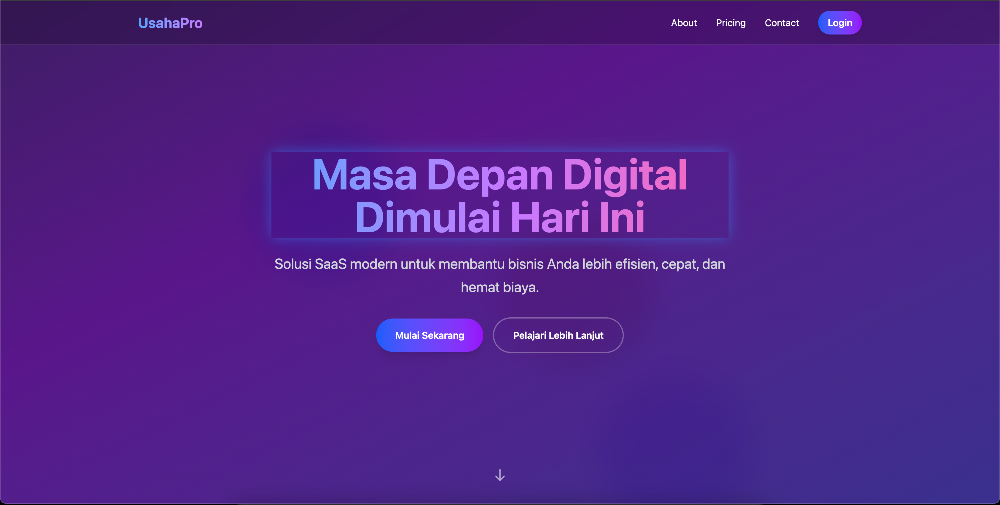

# ✨ Project Name  
Deskripsi singkat & menarik.  
> Contoh: *"Aplikasi To-Do modern dengan React, desain minimalis, cepat, dan mudah digunakan untuk meningkatkan produktivitas harian."*  

---

## 🚀 Demo  
🔗 [Live Demo](https://your-demo-link.com)  

  
*(Tambahkan screenshot/gif biar lebih menarik)*  

---

## 🌟 Fitur Utama  
- 📱 Desain **responsive** (mobile & desktop)  
- ⚡ Performa cepat dengan React + Vite + Typescript

---

## 🛠️ Teknologi yang Digunakan  
- ⚛️ [React](https://react.dev/)  
- 🎨 [Tailwind CSS](https://tailwindcss.com/)
- ⚡ [Vite](https://vitejs.dev/) / Create React App  

---

## 📦 Instalasi  
Clone & jalankan di lokal:  

```bash
git clone https://github.com/conelo03/keda-tech-test.git
cd keda-tech-test
npm install
npm run dev
